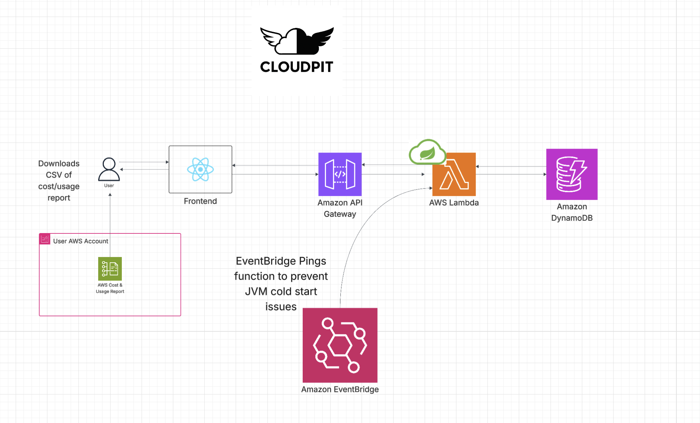

# CloudPit

CloudPit is a serverless cloud cost visualizer that empowers users to track and analyze their AWS spending with effortless transparency. Built on Spring Boot with Spring Cloud Functions integrated with AWS Lambda, API Gateway, and DynamoDB, CloudPit eliminates infrastructure overhead so you can focus on optimizing your cloud budget, not managing servers.

## Features

- **Cost Monitoring**: Track your AWS spending with cost and usage data
- **Serverless Architecture**: Zero server maintenance with fully managed AWS services

## Tech Stack

### Frontend
- React

### Backend
- Spring Boot
- Spring Cloud Functions
- AWS Lambda
- Amazon API Gateway
- Amazon DynamoDB
- Amazon EventBridge

## Cloud Architecture

CloudPit leverages a fully serverless architecture on AWS, combining Spring Boot with AWS Lambda through Spring Cloud Functions.

### Data Flow
1. Users interact with the React frontend to view costs or generate reports
2. API Gateway routes authenticated requests to Lambda functions
3. Spring Cloud Functions invokes Spring Boot business logic
4. User-specific cost data is stored in DynamoDB
5. Users can download reports directly from the frontend

